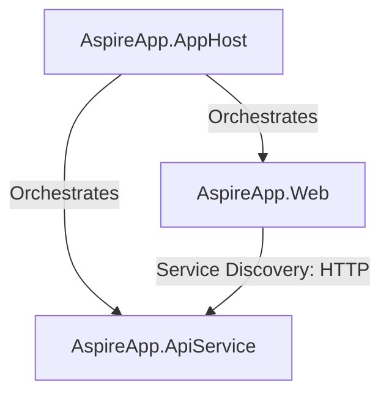

# .NET Aspire Task Management Workspace

A distributed, modern Task Management Kanban Board application built using **.NET Aspire**, **ASP.NET Core Minimal APIs**, and **Blazor Interactive Server Components**. 

This repository leverages the orchestration capabilities of .NET Aspire to manage service connection, discovery, and resiliency between the backend API and frontend web projects.

---

## Architecture Overview

The application consists of the following components:



* **`AspireApp.AppHost`**: The entrypoint project that defines the distributed system, orchestrates service startup, handles service discovery, and spins up the Aspire Dashboard.
* **`AspireApp.ApiService`**: The ASP.NET Core backend hosting REST CRUD endpoints for tasks, using an in-memory thread-safe store.
* **`AspireApp.Web`**: A Blazor server frontend incorporating a highly visual glassmorphic dashboard (Kanban Board) for task tracking.
* **`AspireApp.ServiceDefaults`**: Standard configuration helpers for OpenTelemetry, health checks, and service resilience patterns.

---

## Technology Stack

* **Orchestration**: .NET Aspire 9.0+
* **Backend**: ASP.NET Core Web APIs (Minimal API)
* **Frontend**: Blazor Web App (Interactive Server render mode)
* **Styling**: Vanilla CSS with glassmorphic styling, glowing borders, custom typography (Outfit and Inter Google Fonts), and responsive flex layouts.

---

## Features

* **Distributed Orchestration**: Auto-configured service connection strings and base URLs using Aspire Service Discovery (`https+http://apiservice`).
* **Visual Kanban Board**: Filterable columns representing states: *To Do*, *In Progress*, *In Review*, and *Completed*.
* **Dynamic Analytics**: Live task status counters at the top of the interface.
* **Task CRUD Operations**: Inline form for task creation (Title, Assignee, Description, Priority, Due Date), status transition buttons, and delete actions.

---

## Getting Started

### Prerequisites

* [.NET 9.0 SDK](https://dotnet.microsoft.com/download)
* [.NET Aspire Workload](https://learn.microsoft.com/dotnet/aspire/fundamentals/setup-tooling)

### Trust the Development Certificate

Before running the application, make sure the local HTTPS development certificate is trusted:

```powershell
dotnet dev-certs https --trust
```

### Running the Application

To start the entire distributed system, run the AppHost project:

```powershell
dotnet run --project AspireApp.AppHost
```

Once started, the console will output the URL for the **Aspire Dashboard** (e.g., `https://localhost:17229`). Navigate to this page in your browser to view telemetry, logs, and click the link for the `webfrontend` to access the Task Board.
